# ENSF 592 - Final Project

## Braden Tink

## Chris Valdez

# Data Set and Additional Columns

For our final project we chose a spotify dataset [1] from a public domain server that contains song characteristics. Some of the characteristics in the dataset include key,temp, duration, and loudness. From the original data set we also created two user columns `"total_beats"`, `"boringness"`. These factors are calculated from existing columns in the dataset.

**total beats = (tempo * (duration ms*0.001))/60**

**boringness = loudness + tempo + (energy*100) + (danceability*100)[2]**

# Inputs

To access our dataset, we built a user input that asked for first the genre to create a subset of our original dataset. Next the user will be asked to enter in a song title as not all songs are continued in the dataset. We also give recommendations if the user can not think of a song belonging to that genre.

# Outputs

## PieChart

From the dataset we have multiple graphs depicting the dataset. First we use a pie chart that shows the total songs based on genre over the whole dataset. This allows the user to get an idea of the dataset as a whole. The user-selected genre is also highlighted by popping it out from the chart to quickly see its part in the pie chart.
 
 
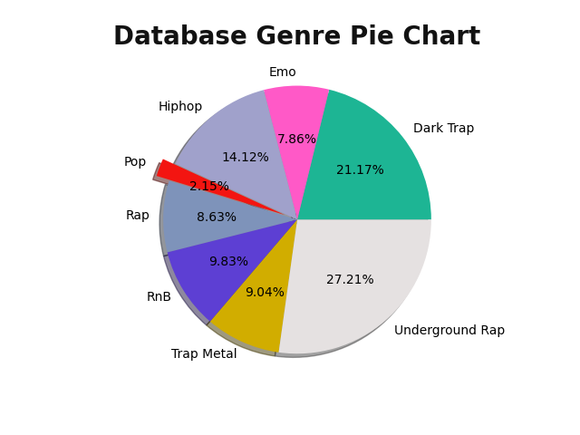
 
 

## Distribution Curves

For the distribution curves we plotted all the value columns showing their concentration. The graphs allow us to quickly see characteristics of the whole data set.
 
 
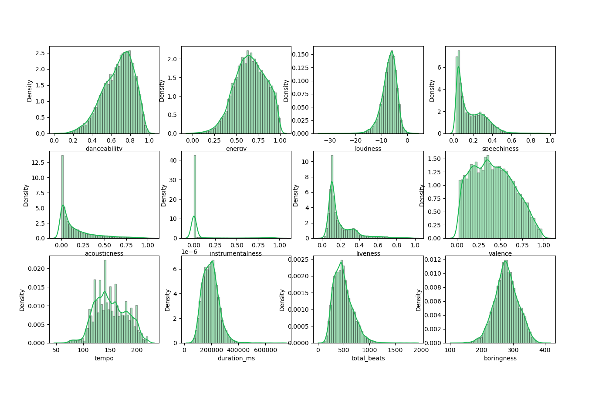
 
 

## Pivot Table

Our pivot table takes the genre as our index while a cut on the tempo column aggregating by forty is the columns. The values are then the duration of the song. The pivot table represents how the tempo of the song correlates to the duration of the song. Based on the table we can conclude that for certain genres like rap as tempo increases the duration decreases. We can also see Rap songs usually have the longest durations while Trap Metal have the shortest across all tempos.
 
 
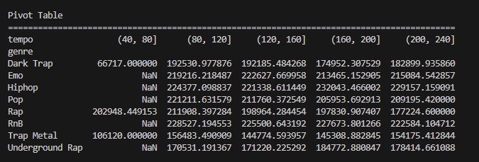
 
 

## Describe Table

The describe table uses the built in feature describe to give us some general stats on each column. This can be useful for gathering information such as the max, min, and mean of any column.
 
 
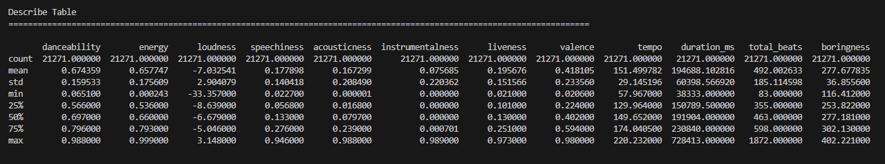

## BarChart

The bar chart created takes in the user selected song and then compares its values against the dataset mean values over selected columns. This graph allows the user to see how the selected song lines out to the whole dataset in both the min and max values of the dataset.
 
 
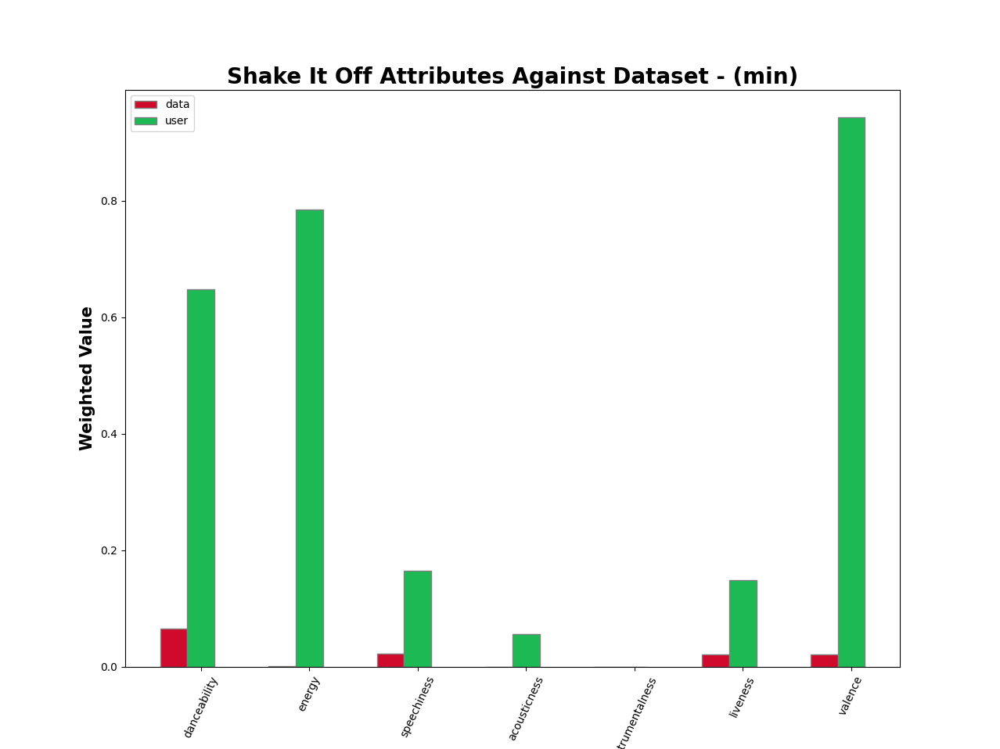
 
 
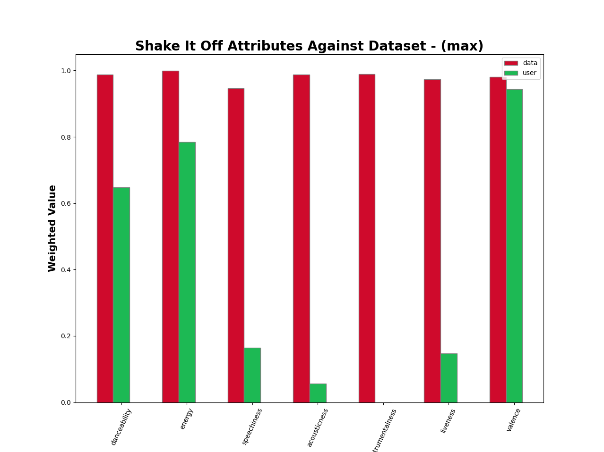

## Boringness Scatter Plot

For the scatter plot curve we plotted "Total Beats" vs "Boringness" for the entered genre. From the graph when we used Rap as the genre that its left skewed. Where the lower the "Total Beats" the less boring the song was. This distribution holds true for many genres if the "Total Beats" is increased the songs "Boringness" increases. As well based on the user input we plot the user selected song in red to show how it performs to songs in its same genre.

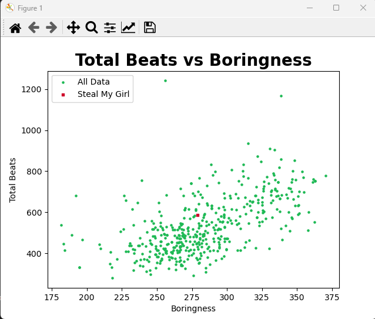

# Execution

Starting the program theere is a welcome message for a new user before asking the user for the first input. The first input the user gives is the genre. As the programs dataset does not contain all genres a list is given to help the user on selection.
 
 
After selecting the genre the user is then asked for a song as the second input. Again as the dataset does not contain all songs of that specific genre a list of songs is given from our data set. Once both inputs are given the outputs for the dataset and song are outputted.
 
 
During the input section of the program the user can enter 'q' or 'quit' to exit the program.
 
 
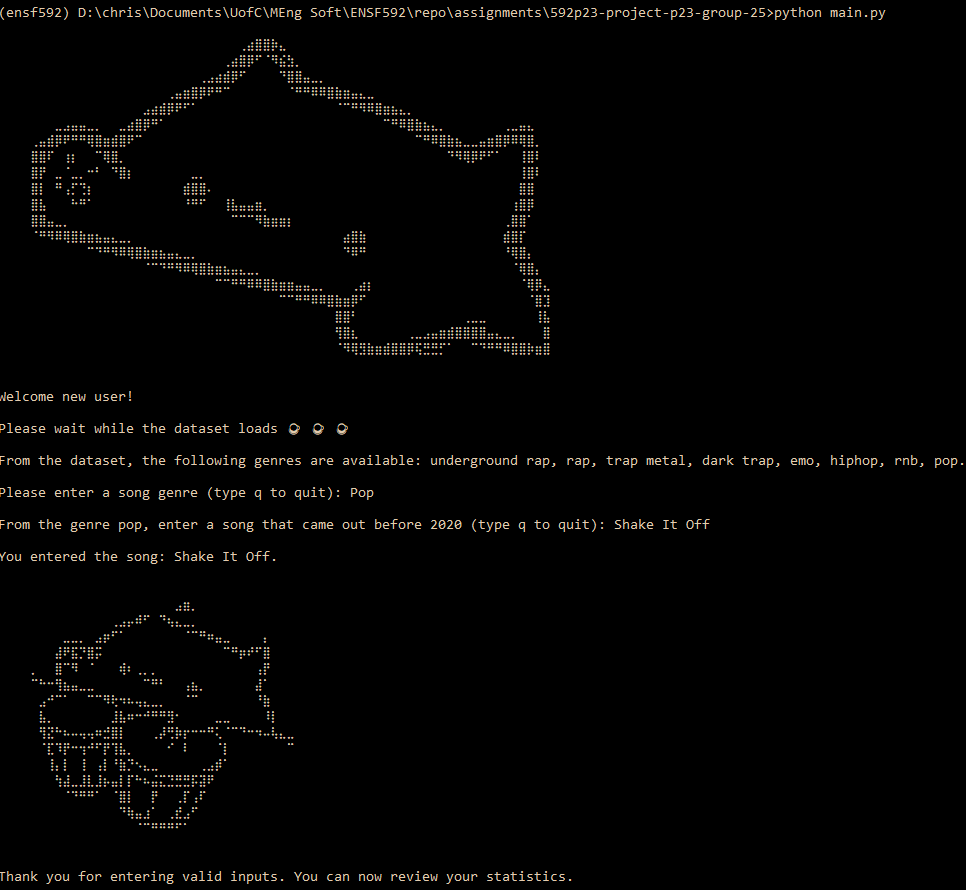
 
 
If a user selectes the incorrect genre the program notifies the user and asks them to enter a different input. For song data if the user enters in an incorrect song a list of sengs from that genre is outputted.
 
 
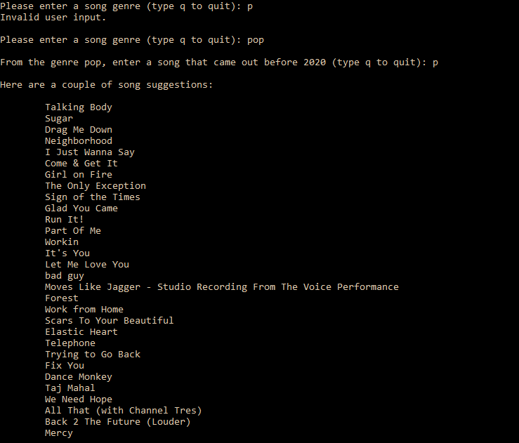
 
 
A brief explination is outtputted before the user sees the bar grapghs in order to get context.
 
 
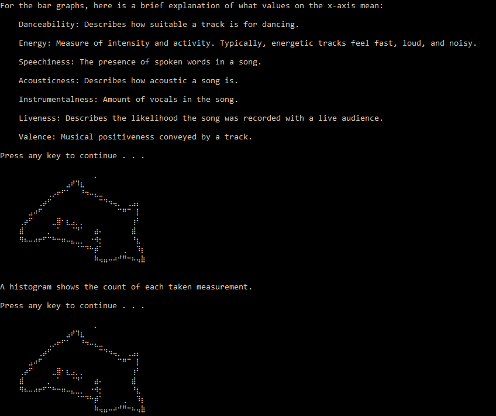
 
 
At the end of the program we suggest a similar song based on the user input. As well we notify you that the dataset has been exported to the listed file.
 
 
A goodbye message is then shown to notify the user that the program has finished.
 
 
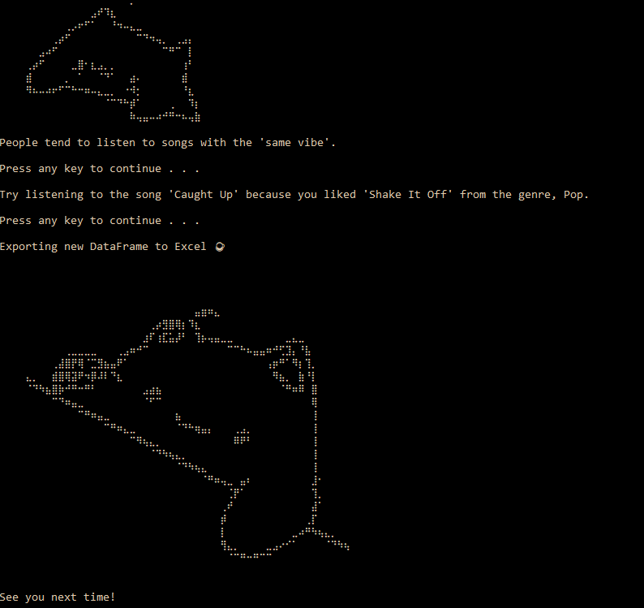

## References:

[1] DataSet
CC0: Public Domain
Dataset of songs in spotify Accessed June 8, 2023

[2] Juan De Dios Santos
Is my Spotify music boring? An analysis involving music, data, and machine learning | by Juan De Dios Santos | Towards Data Science May 28, 2017
